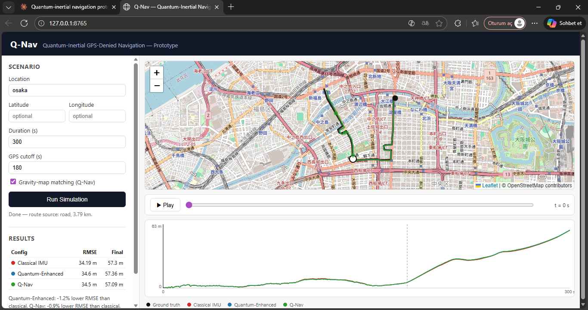
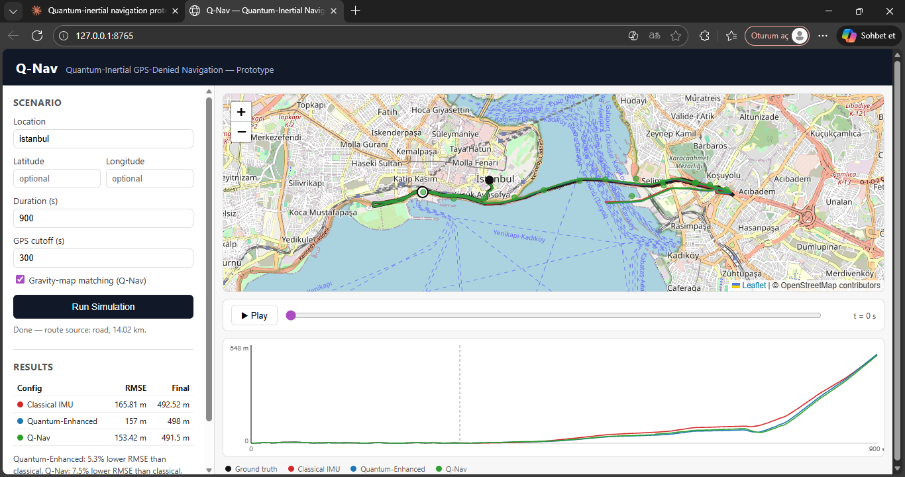
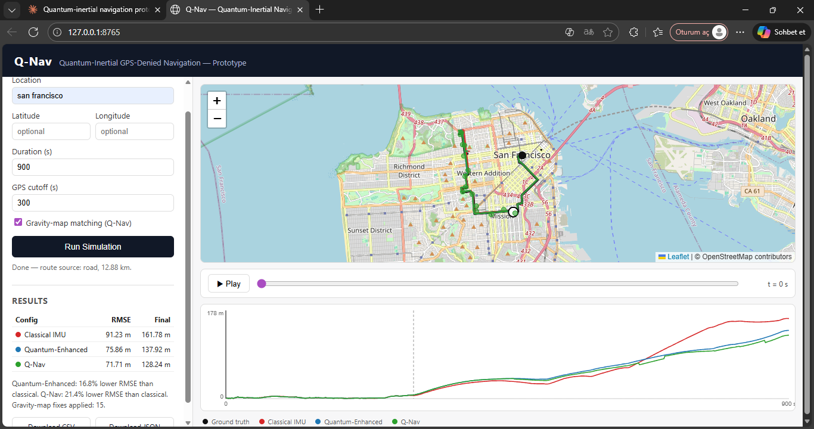

# Q-Nav — Quantum-Inertial Navigation Prototype

A working prototype of GPS-denied positioning using physics-grounded models
of **atom-interferometer quantum sensors** (accelerometer, gyroscope,
gravimeter), fused with an Extended Kalman Filter and corrected via
**gravity map matching**. Runs anywhere in the world — defaults to San
Francisco, USA, and accepts any location via `--location` (optional
geocoding) or `--lat`/`--lon` (fully offline, no API required).

This is not "we simulated a quantum version of GPS." Quantum navigation
research has nothing to do with satellites — the actual idea is
**positioning without any GNSS/GPS signal at all**, using inertial sensors
whose physics happens to be quantum-mechanical. NIST describes this
explicitly as GPS-free navigation based on quantum accelerometers and
gyroscopes. A study published August 26, 2026 demonstrated exactly this
combination in the real world: a mobile quantum gravimeter + a classical
IMU, tracking an 83 km marine route with no GNSS, using gravity map
matching. Q-Nav reproduces the same architecture, scaled down to a ground
vehicle route and implemented end-to-end in Python.

```
❌ Not a random "quantum-inspired" algorithm
❌ Not QAOA glued onto GPS
✅ Real quantum-sensing physics (atom-interferometer phase equations)
   integrated into a working navigation stack
```

## Web UI

```bash
python app.py
```

Opens `http://127.0.0.1:8765` in your browser: a single page where you can
set the location, GPS cutoff, duration, and toggle gravity-map matching,
then hit **Run Simulation**. It shows the reference (ground-truth) route
plus the Classical IMU, Quantum-Enhanced, and Q-Nav trajectories on a real
OpenStreetMap map, a Play/Pause animation of all four tracks moving
together with a scrub bar, a live drift chart, and a clear
**"📡 GPS SIGNAL LOST"** banner plus a marker the moment the cutoff is
reached — with **Download CSV** / **Download JSON** buttons for the
results. `python app.py --port 9000` picks a different port;
`--no-browser` skips auto-opening a tab.

The web UI is a thin presentation layer over `qnav.simulation.runner.run_simulation()`
— the exact same function the CLI demo calls — served with Python's
built-in `http.server` (no Flask/Django, zero extra dependencies). The
frontend is plain HTML/CSS/JS with Leaflet for the map and a hand-drawn
`<canvas>` chart for drift — no bundler, no JS framework, no charting
library.

## Real road-network routes

By default, the ground-truth route is fetched from the **real OpenStreetMap
road network** via OSRM, so the simulated vehicle drives on actual roads
and never cuts through buildings, parks, or water — those simply aren't
part of the drivable road graph OSRM routes on. This requires network
access. If it's unavailable (offline, OSRM down, no route found), Q-Nav
automatically falls back to an offline analytic route generator and prints
a one-line notice; nothing crashes, and the rest of the pipeline (sensors,
EKF, gravity map matching) doesn't care which one produced the path. Pass
`--no-road-network` (CLI) to skip the network attempt entirely.

## Why this is a real engineering problem, not hand-waving

Atom interferometry works by splitting a laser-cooled atom cloud's wave
function into two paths with Raman laser pulses. Under acceleration or
rotation, the two paths accumulate different quantum phases; recombining
them produces an interference pattern that encodes that phase difference:

```
dphi = k_eff * a * T^2          (accelerometer / gravimeter)
dphi = (2*m/hbar) * A * Omega   (gyroscope, atomic Sagnac effect)
```

These are the actual working equations of real atom-interferometer
hardware (Kasevich & Chu 1991; Peters, Chung & Chu 2001; Imperial College
London and University of Southampton quantum inertial sensing research).
Q-Nav implements these equations directly in `qnav/sensors/`, including
the **Standard Quantum Limit** (shot-noise-limited phase precision,
`1/sqrt(N)` for N atoms) and the realistic trade-off that current quantum
sensors have very low bias drift but also low bandwidth (cycle time ~0.1–1
s, because the atom cloud must be re-prepared between measurements).
Miniaturization, bandwidth, and mobile-platform integration are open
problems in this field — Q-Nav's software does not pretend to replace real
hardware; it is the navigation stack such hardware would plug into.

## Demo Screenshots

### Q-Nav Web UI



### Trajectory Comparison



### Drift Analysis



## Architecture

```
        Road-Network Route (OSRM)  ──fallback──▶  Synthetic Route (offline)
                        │
                        ▼
                 IMU / Simulated IMU
                        │
       ┌────────────────┴────────────────┐
       ▼                                  ▼
Classical Accelerometer          Quantum Accelerometer
       +                                  +
Classical Gyroscope               Quantum Gyroscope
       │                                  │
       └────────────────┬─────────────────┘
                         ▼
                  Extended Kalman Filter
                  (shared fusion core)
                         │
              ┌──────────┴──────────┐
              ▼                     ▼
        GPS fix (while on)   Quantum Gravimeter (optional toggle)
                                    │
                              Gravity Map Matching
                              (correlation search)
                                    │
                                    ▼
                          Corrected Position Estimate
                                    │
              ┌─────────────────────┼─────────────────────┐
              ▼                     ▼                      ▼
     Trajectory/Drift plots   Web UI (map + animation)   CSV / JSON export
```

Both the classical and quantum configurations run through the **exact same
EKF class** (`qnav/fusion/ekf.py`) — only the sensor noise/bias
characteristics fed into it differ. This makes the comparison fair and the
fusion architecture sensor-agnostic, exactly as it would be with real
hardware. None of this — sensors, INS mechanization, EKF, gravity map
matching — changed while adding road routing, the web UI, or the export
features; `qnav/simulation/runner.py` is the single place that wires them
together and is what both the CLI and the web UI call.

## What the demo actually does

1. Give the system a starting position — **anywhere in the world**
   (default: San Francisco, USA).
2. Drive a route (default ~11.7 km) with realistic turns and speed
   changes, following real roads whenever network access allows it.
3. Turn GPS off at a configurable cutoff time (default 300 s).
4. From that point on, three configurations navigate using only their own
   sensors:
   - **Classical IMU** — pure dead-reckoning with MEMS-grade noise/bias
   - **Quantum-Enhanced IMU** — pure dead-reckoning with atom-interferometer
     noise/bias (much lower drift, same EKF)
   - **Q-Nav (full system)** — quantum IMU **plus** a quantum gravimeter
     whose readings are periodically matched against a gravity-anomaly map
     to pull the estimate back toward the truth, with no GPS at all
     (toggle this off to see the quantum IMU alone)
5. Compare drift quantitatively (RMSE, CEP50, final error) and visually,
   in static plots, an interactive HTML map, or the live web UI — and
   export the full run as CSV/JSON.

## Configuring a run

Every entry point (CLI and web UI) exposes the same four knobs:

| Knob                    | CLI flag                | Web UI field              | Default            |
|--------------------------|-------------------------|----------------------------|---------------------|
| Location                 | `--location` / `--lat`/`--lon` | Location / Lat / Lon | San Francisco, USA |
| GPS cutoff time           | `--gps-cutoff`          | GPS cutoff (s)             | 300 s               |
| Route duration            | `--duration`            | Duration (s)               | 900 s               |
| Gravity-map matching      | `--no-gravity-matching` | checkbox                   | on                  |

(`--no-road-network` is CLI-only, for fast/fully-offline runs; the web UI
always attempts real roads first and falls back automatically.)

## Worldwide location support

Q-Nav runs at **any location on Earth**. This only changes where the
interactive HTML map is centered and labeled — the physics (sensors, INS
mechanization, EKF fusion, gravity map matching) is entirely local and
location-agnostic, so drift numbers are unaffected by where you run it.

```bash
# Default: San Francisco, USA — no flags needed
python examples/run_demo.py

# Any place name, resolved via the free OpenStreetMap Nominatim API
# (optional convenience feature, requires network access)
python examples/run_demo.py --location "Tokyo, Japan"

# Exact coordinates — fully offline, no network/API required at all
python examples/run_demo.py --lat 48.8566 --lon 2.3522

# Coordinates + a friendly label for the plots/map (still fully offline)
python examples/run_demo.py --lat 48.8566 --lon 2.3522 --location "Paris, France"
```

Priority order: `--lat`/`--lon` (exact, offline) > `--location` (geocoded,
optional network) > default (San Francisco, USA). If `--location` is given
but geocoding fails for any reason — no network, no match, a Nominatim
outage — Q-Nav prints a warning and falls back to the default location
instead of crashing; the core simulation **never requires internet
access**. Geocoding is implemented with the Python standard library only
(`urllib` + `json`), so no extra dependency is needed for this feature.

## Example results

From a single run (seeded, reproducible) of the included scenario —
11.7 km route, GPS off for the final 600 s. These numbers are identical
regardless of which location you run at, since the underlying local-frame
physics is unchanged:

| Configuration                     | RMSE (m) | CEP50 (m) | Final Error (m) |
|-----------------------------------|---------:|----------:|-----------------:|
| Classical IMU (Dead Reckoning)    |     35.3 |      29.1 |             66.6 |
| Quantum-Enhanced IMU              |     15.5 |      11.5 |             30.0 |
| Q-Nav (Quantum + Gravity Map)     |     12.8 |      10.5 |             21.9 |

Quantum-only sensing already cuts RMSE by ~56% relative to classical MEMS;
adding gravity map matching (no GPS involved) cuts it further to ~64%, and
visibly bounds the drift instead of letting it grow unboundedly (see
`output/drift_comparison.png` after running the demo — the green Q-Nav
curve gets pulled back down every time a gravity-map fix is applied).

Numbers will vary slightly with different random seeds, but the ordering
(classical > quantum-only > quantum+gravity) is a structural result of the
sensor models, not a cherry-picked run.

## Project structure

```
q-nav/
├── app.py                          # launches the local web UI (python app.py)
│
├── qnav/                          # the library
│   ├── sensors/
│   │   ├── imu_classical.py       # MEMS accel+gyro (Allan-variance noise model)
│   │   ├── quantum_accel.py       # atom-interferometer accelerometer (Mach-Zehnder)
│   │   ├── quantum_gyro.py        # atom-interferometer gyroscope (Sagnac effect)
│   │   └── quantum_gravimeter.py  # atom-interferometer gravimeter
│   │
│   ├── fusion/
│   │   ├── state.py               # EKF state vector definition
│   │   ├── process_models.py      # strapdown INS mechanization + Jacobian
│   │   └── ekf.py                 # Extended Kalman Filter core
│   │
│   ├── gravity/
│   │   ├── gravity_map.py         # synthetic gravity-anomaly reference map
│   │   └── map_matching.py        # correlation-based absolute position fix
│   │
│   ├── simulation/
│   │   ├── trajectory.py          # ground-truth route (road-network or synthetic)
│   │   ├── road_route.py          # optional OSRM road-network route fetching
│   │   ├── gps_simulator.py       # GPS on/off scenario, realistic fix noise
│   │   ├── noise_models.py        # Allan deviation analysis utility
│   │   ├── location.py            # worldwide start-location resolution (offline-first)
│   │   ├── geocode.py             # optional Nominatim geocoding (stdlib only)
│   │   └── runner.py              # single reusable simulation loop (used by CLI + web UI)
│   │
│   ├── comparison/
│   │   ├── drift_analysis.py      # RMSE / CEP50 / final-error metrics
│   │   └── export.py              # CSV trajectory export + JSON benchmark export
│   │
│   ├── viz/
│   │   └── map_view.py            # matplotlib plots + interactive Leaflet map
│   │
│   └── web/
│       ├── server.py               # stdlib http.server backend + JSON API
│       └── static/                 # index.html, app.js, style.css (no build step)
│
├── examples/
│   └── run_demo.py                # CLI demo (start here if you prefer the terminal)
│
├── tests/
│   ├── test_ekf.py
│   ├── test_quantum_accel.py
│   ├── test_map_matching.py
│   ├── test_geocode.py            # mocked network calls, no real HTTP requests
│   ├── test_location.py           # offline resolution logic + mocked geocoding
│   ├── test_road_route.py         # mocked OSRM + offline path-resampling logic
│   ├── test_runner_and_export.py  # simulation loop + CSV/JSON export
│   └── test_web_server.py         # real HTTP server, run in-process
│
├── output/                        # generated by run_demo.py
├── requirements.txt
└── pyproject.toml
```

## Running it

```bash
pip install -r requirements.txt

# Web UI
python app.py

# CLI
python examples/run_demo.py                                  # default: San Francisco, USA
python examples/run_demo.py --location "Paris, France"
python examples/run_demo.py --lat -33.8688 --lon 151.2093     # Sydney
python examples/run_demo.py --duration 600 --gps-cutoff 180
python examples/run_demo.py --no-gravity-matching
python examples/run_demo.py --no-road-network                 # fast, fully offline
```

The CLI demo writes to `output/`:

- `trajectory_comparison.png` — all three trajectories vs. ground truth,
  with a zoom inset on the final drift
- `drift_comparison.png` — position error over time, GPS-off marked
- `interactive_map.html` — open in a browser: real OpenStreetMap tiles
  centered on the chosen location, with all trajectories overlaid
- `summary.txt` — the numeric comparison table, including the resolved
  location and coordinates
- `trajectories.csv` — per-timestep positions (local meters + lat/lon) for
  the ground truth and all three configurations
- `benchmark.json` — the numeric comparison plus run metadata (location,
  route source, gravity-matching setting, improvement percentages)

Run the tests with:

```bash
python tests/test_ekf.py
python tests/test_quantum_accel.py
python tests/test_map_matching.py
python tests/test_geocode.py
python tests/test_location.py
python tests/test_road_route.py
python tests/test_runner_and_export.py
python tests/test_web_server.py
```

All tests are fully offline — network-touching code (`geocode.py`,
`road_route.py`) is exercised through mocked calls, and `test_web_server.py`
starts the real `http.server` backend in-process (127.0.0.1 only), so no
internet access or live Nominatim/OSRM request is needed to run the test
suite.

## Honest limitations

- The "quantum sensors" here are **physically-grounded software models**
  of atom-interferometer behavior (shot-noise limit, Sagnac scale factor,
  realistic cycle times), not actual hardware drivers — because the
  hardware is still lab-scale, expensive, and not yet integrated into
  mobile platforms. That gap is exactly why a navigation-stack prototype
  like this is useful: it's software that real quantum inertial sensors
  could plug into once miniaturization/bandwidth problems are solved.
- The gravity-anomaly map is synthetic (multi-frequency noise + localized
  Gaussian features), not a real geodetic dataset (e.g. EGM2008). The
  matching algorithm and its EKF integration are real; the map itself is a
  stand-in for one you'd load from an actual gravity survey.
- Gravity map matching here uses a brute-force grid search for clarity;
  production systems typically use particle filters or continuous
  correlation optimization for the same task.
- The route/duration are scaled down from the 83 km marine reference case
  to keep the demo fast to run and inspect; the underlying equations don't
  care about scale.
- The equirectangular projection used to place the local-frame route on a
  real-world map (`local_xy_to_latlon`) is a small-distance approximation;
  it's accurate enough for an ~12 km route anywhere on Earth, but is not a
  general-purpose geodesic projection for very long routes or polar
  latitudes.
- Geocoding via `--location` depends on the public Nominatim API being
  reachable; it's an optional convenience layered on top of a simulation
  that otherwise never needs network access.
- Real road-network routing depends on the public OSRM demo server being
  reachable and rate-limit-friendly usage; it automatically falls back to
  the offline synthetic route generator otherwise. The OSRM demo server is
  a shared public resource — for heavy/production use, point
  `road_route.OSRM_ROUTE_URL` at a self-hosted OSRM instance.
- The web UI runs simulations synchronously per request and keeps only the
  most recent result in memory for CSV/JSON export — it's a local,
  single-user tool (`python app.py`, served on 127.0.0.1), not a
  multi-tenant web service.
- The web UI's map/chart data is decimated (to ~600 points) for smooth
  browser rendering; the CSV/JSON exports and the CLI's own plots always
  use the full-resolution simulation.
- Real road polylines have sharp corners at intersections that a vehicle
  can't actually turn through instantaneously. `generate_route_from_path`
  now uses curvature-based speed planning (the vehicle slows for sharp
  turns and brakes to a stop at an open path's end, the same
  forward/backward-solver approach used in autonomous-vehicle and
  racing-line trajectory planning) plus geometric corner-rounding, so
  derived accelerations and heading stay physically plausible even on
  dense, frequently-turning real city streets. Heading (yaw) is held at its
  last reliable value whenever speed drops too low for atan2(vy, vx) to be
  numerically meaningful, matching how real navigation systems treat
  heading as unobservable at a standstill.
- Open (non-looped) paths that finish before the requested duration hold
  position at the endpoint rather than reversing back along themselves —
  this can leave a tiny residual dead-reckoning velocity that coasts for
  the remainder of a very long "hold". This only matters for synthetic,
  non-closed test paths; real OSRM routes are always requested as closed
  loops (see `road_route._loop_waypoints`) and are extended by lap
  repetition instead, which has no such artifact.

## References

- Kasevich, M. & Chu, S. (1991), atom interferometer accelerometry
- Peters, A., Chung, K.Y. & Chu, S. (2001), absolute atom gravimeter
- Gustavson, T.L., Bouyer, P. & Kasevich, M.A. (1997), atom interferometer
  gyroscope (Sagnac effect)
- NIST, quantum accelerometer/gyroscope-based GPS-free navigation
- Bidel, Y. et al. (2018) and follow-on work, mobile marine/airborne
  quantum gravimetry
- 83 km GNSS-free marine gravity-map-matching demonstration, published
  August 26, 2026 (mobile quantum gravimeter + classical IMU)
- IEEE Std 952-2020, Inertial Sensor Terminology (Allan variance)
- Titterton, D.H. & Weston, J.L., "Strapdown Inertial Navigation
  Technology"
